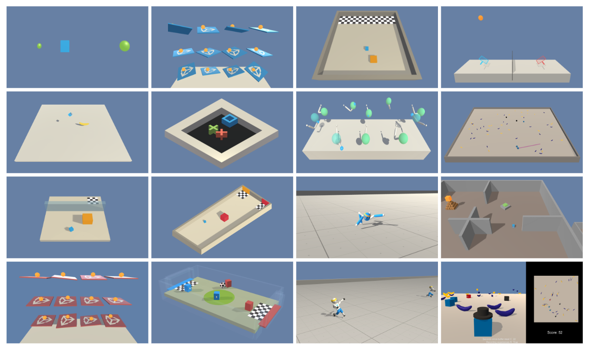

# ！Attention！

これはNon-biriがML-Agentを用いた卒業研究とGitの練習のために作成したリポジトリです。
元のUnity ML-Agentsとは関係ありません。また動作する保証もありません。
利用にはUnity EditorやAnacondaに関する基礎的な知識が知識が必要となります。
これを使用することで起きた損害、被害等に関して作成者は一切責任を負いません。
ご利用の際は全て自己責任でお願いいたします。

This is a repository created by Non-biri for graduation research and Git practice using ML-Agent.
It has nothing to do with the original Unity ML-Agents. There is no guarantee that it will work.
Use requires basic knowledge of Unity Editor and Anaconda.
The creator is not responsible for any damage or damage caused by using this.
Please use it at your own risk.

## Abstract

Unity社が公開している機械学習用フレームワーク「Unity ML-Agents」を用いて強化学習エージェントに個性を持たせられないか研究しました。
サンプル「GridWorld」を改造して10×10の迷路環境を構築しています。
また、エージェントに3種類の性格パラメータを持たせ、それを調整することで学習に個性が現れないか検証することが出来ます。

## Setup
以下の環境で実装しました。セットアップの手順はML-Agentsの公式ドキュメントに従いつつ各所で読み替えて実装してください。
Unity Editorのバージョンは2017.4以上であっても動く可能性がありますが未検証です。

―――――

* OS : Windows10
* Unity Hub 2.2.X (2.2以上)
* Unity Editor Version 2017.4.10f1
* Visual Studio Community 2017
* ML-Agents Download Repository tag : 0.9.3
* Anaconda : 2019.10
* Python : 3.6.9
* 仮想環境にインストールしたML-AgentsのVersion : 0.9.3

―――――

## Experiment

Assets>ML-Agents>Example>GridWorld>Scenes>GridWorld_Re で対象のSceneを開くことが出来ます。
サンプル「GridWorld」との大きな変更点に以下ような内容があります。

**「trueAgent」に以下の三種類のパラメータの追加**

* 「acquisitionRate」	初期値：1	範囲：1～50
　追加報酬（〇）を優先する性格になる．値を増 加させることで追加報酬に接触した際に得られる報酬量を増加させられる．
* 「shorteningRate」	初期値：1	範囲：0～1
　ゴール（＋）に優先する性格になる．経過したステップ数に反比例して報酬量を減少させる．
* 「graspingRate」	初期値：1	範囲：1～50
　探索報酬（半透明の□）を優先する性格になる．接触した際の報酬を計算する際に用いる値を保存する．

**エージェントに報酬を与える三種類のオブジェクト要素の追加**
* sWallPref	：壁（灰色の□）		進行しようとすると若干のマイナス報酬を獲得しつつ、エージェントを行動前の座標に戻します
* exReward	：追加報酬（橙色の〇）		性格パラメータ「acquisitionRate」の値に応じて追加で報酬を獲得できます
* mappingCube	：探索報酬（橙色半透明の□） 	進行可能な方向に向かって進行できた場合、マスごとに一度だけ若干の報酬を獲得できます。

Unity Editorのplayボタンを押して実行すると、既に適用されている学習モデルを用いて動作します。
学習を行わせる場合は[こちら](https://github.com/Non-biri/ml-agents-Individuality-Experiment/blob/master/docs/Basic-Guide.md#training-the-brain-with-reinforcement-learning)などを参考に実行してみてください。
その際エージェントの各種パラメータを変更することで学習結果を変化させることが出来ます。

## Expected results

この環境を通して、エージェントのパラメータ変更することで以下のような結果を得ることが出来ます。
* 学習過程の変化（TensorBoardの結果参考）
* 報酬ごとの獲得割合

今回卒業研究の段階では学習完了後のエージェントの行動に大きな変化を出すことは出来ませんでした。
課題として環境はもちろんエージェントの行動目的に問題があると考えています。
今回はサンプルGridWorldを改造する形で実装していましたが、サンプルの段階でエージェントの目的はより少ないエピソード長でゴールに到達することが求められています。
今回の環境ではその部分を上手く修正することが出来ず、追加報酬などその他の報酬要素や、性格ごとに求める報酬の種類を変えても、目立った変化が得られなかったことが考えられます。

ですが3種類の性格パラメータを用いることで、TensorBoard統計結果上では学習過程に変化が発生していました。
性格パラメータの要素を活かしつつ、エージェントが性格ごとにどれだけ自由に探索を行い、その結果としてそれぞれに個性のある学習結果が得られるのか、
また個性を獲得させるのにはどのようなやり方が正しいのか、それらをこれからさらに研究・模索していこうと考えています。

# --------------------

# Unity ML-Agents Toolkit (Beta)

**The Unity Machine Learning Agents Toolkit** (ML-Agents) is an open-source
Unity plugin that enables games and simulations to serve as environments for
training intelligent agents. Agents can be trained using reinforcement learning,
imitation learning, neuroevolution, or other machine learning methods through a
simple-to-use Python API. We also provide implementations (based on TensorFlow)
of state-of-the-art algorithms to enable game developers and hobbyists to easily
train intelligent agents for 2D, 3D and VR/AR games. These trained agents can be
used for multiple purposes, including controlling NPC behavior (in a variety of
settings such as multi-agent and adversarial), automated testing of game builds
and evaluating different game design decisions pre-release. The ML-Agents
toolkit is mutually beneficial for both game developers and AI researchers as it
provides a central platform where advances in AI can be evaluated on Unity’s
rich environments and then made accessible to the wider research and game
developer communities.

## Features

* Unity environment control from Python
* 10+ sample Unity environments
* Support for multiple environment configurations and training scenarios
* Train memory-enhanced agents using deep reinforcement learning
* Easily definable Curriculum Learning and Generalization scenarios
* Broadcasting of agent behavior for supervised learning
* Built-in support for Imitation Learning
* Flexible agent control with On Demand Decision Making
* Visualizing network outputs within the environment
* Simplified set-up with Docker
* Wrap learning environments as a gym
* Utilizes the Unity Inference Engine
* Train using concurrent Unity environment instances

## Documentation

* For more information, in addition to installation and usage instructions, see
  our [documentation home](docs/Readme.md).
* If you are a researcher interested in a discussion of Unity as an AI platform, see a pre-print of our [reference paper on Unity and the ML-Agents Toolkit](https://arxiv.org/abs/1809.02627). Also, see below for instructions on citing this paper.
* If you have used an earlier version of the ML-Agents toolkit, we strongly
  recommend our [guide on migrating from earlier versions](docs/Migrating.md).

## Additional Resources

We have published a series of blog posts that are relevant for ML-Agents:

* Overviewing reinforcement learning concepts
  ([multi-armed bandit](https://blogs.unity3d.com/2017/06/26/unity-ai-themed-blog-entries/)
  and
  [Q-learning](https://blogs.unity3d.com/2017/08/22/unity-ai-reinforcement-learning-with-q-learning/))
* [Using Machine Learning Agents in a real game: a beginner’s guide](https://blogs.unity3d.com/2017/12/11/using-machine-learning-agents-in-a-real-game-a-beginners-guide/)
* [Post](https://blogs.unity3d.com/2018/02/28/introducing-the-winners-of-the-first-ml-agents-challenge/)
  announcing the winners of our
  [first ML-Agents Challenge](https://connect.unity.com/challenges/ml-agents-1)
* [Post](https://blogs.unity3d.com/2018/01/23/designing-safer-cities-through-simulations/)
  overviewing how Unity can be leveraged as a simulator to design safer cities.

In addition to our own documentation, here are some additional, relevant articles:

* [Unity AI - Unity 3D Artificial Intelligence](https://www.youtube.com/watch?v=bqsfkGbBU6k)
* [A Game Developer Learns Machine Learning](https://mikecann.co.uk/machine-learning/a-game-developer-learns-machine-learning-intent/)
* [Explore Unity Technologies ML-Agents Exclusively on Intel Architecture](https://software.intel.com/en-us/articles/explore-unity-technologies-ml-agents-exclusively-on-intel-architecture)

## Community and Feedback

The ML-Agents toolkit is an open-source project and we encourage and welcome
contributions. If you wish to contribute, be sure to review our
[contribution guidelines](CONTRIBUTING.md) and
[code of conduct](CODE_OF_CONDUCT.md).

If you run into any problems using the ML-Agents toolkit,
[submit an issue](https://github.com/Unity-Technologies/ml-agents/issues) and
make sure to include as much detail as possible.

Your opinion matters a great deal to us. Only by hearing your thoughts on the Unity ML-Agents Toolkit can we continue to improve and grow. Please take a few minutes to [let us know about it](https://github.com/Unity-Technologies/ml-agents/issues/1454).

For any other questions or feedback, connect directly with the ML-Agents
team at ml-agents@unity3d.com.

## Translations

To make the Unity ML-Agents toolkit accessible to the global research and
Unity developer communities, we're attempting to create and maintain
translations of our documentation. We've started with translating a subset
of the documentation to one language (Chinese), but we hope to continue
translating more pages and to other languages. Consequently,
we welcome any enhancements and improvements from the community.

* [Chinese](docs/localized/zh-CN/)
* [Korean](docs/localized/KR/)

## License

[Apache License 2.0](LICENSE)

## Citation

If you use Unity or the ML-Agents Toolkit to conduct research, we ask that you cite the following paper as a reference:

Juliani, A., Berges, V., Vckay, E., Gao, Y., Henry, H., Mattar, M., Lange, D. (2018). Unity: A General Platform for Intelligent Agents. *arXiv preprint arXiv:1809.02627.* https://github.com/Unity-Technologies/ml-agents.
